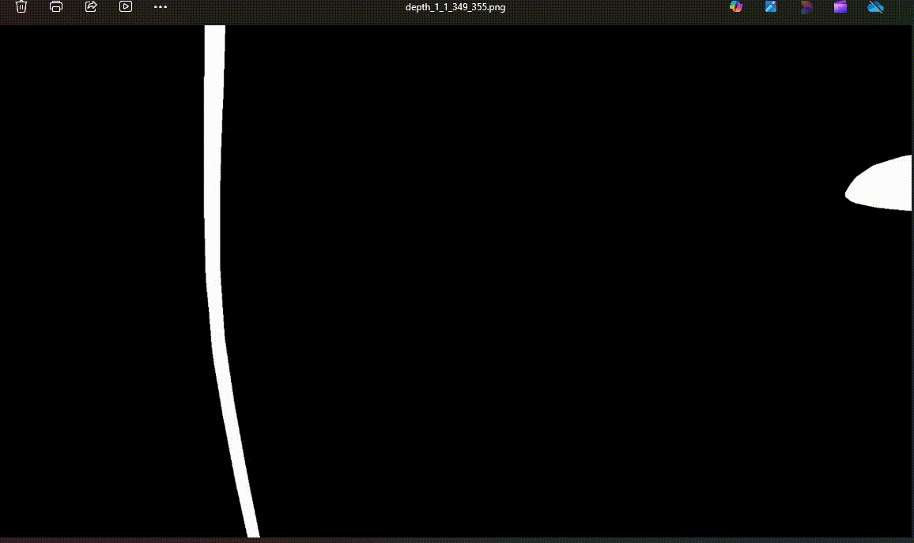
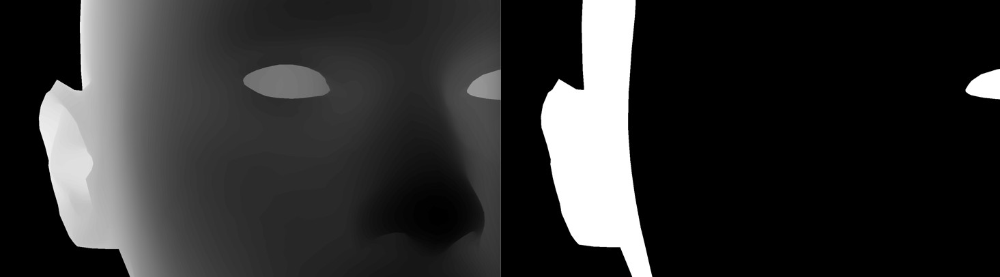
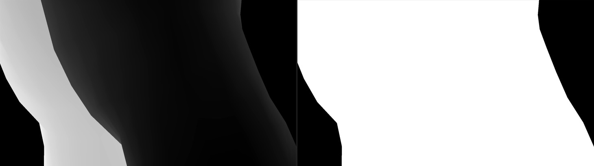

### Exercice Code Technique

The provided file `calibration.csv` is the result of a calibration of a camera body and lens, allowing you to determine the settings required on the camera to obtain a sharp image at the desired depths (depths orthogonal to the camera). The provided `depth*.png` images are 16-bit PNG files in which each pixel represents the depth (orthogonal in millimeters) of the scene captured by the camera (in the camera’s reference frame).

Write a C++ command-line application that takes the two files (calibration and depth image) as parameters and simulates shooting the images necessary to obtain the entire scene in focus. You must implement an API that represents the camera controller and displays the actions called in the console (set, get, etc.). Adjusting the camera parameters is an asynchronous action that requires checking the parameter state before taking a picture. For each photo, a mask of the areas that are in focus is expected. You must also write unit tests for one feature of your choice.

Vocabulary

| Term           | Meaning                                    |
|----------------|--------------------------------------------|
| FD             | Distance from the sensor to the target     |
| PPN            | Nearest sharp plane (Front In-Focus Plane) |
| DPN            | Farthest sharp plane (Back In-Focus Plane) |
| Focus Position | Motor parameter controlling the focus      |

The prodided input data are store gere: `/data`.


### Prerequisite
For time reasons I've chosen opencv to handle the pixel matrices. 

```
sudo apt-get install libopencv-dev
```

### Build & Run unit tests

Ensure you have gcc or any c++ compiler added into your system path. Then, run the following commands on Windows for example:

Build directly from project root directory:
```bash
cmake -S . -B build && cmake --build build
```

Run unit tests:
```bash
cd build && ctest
```
For more detailed output:
```bash
cd build/components/test && ./unit_tests
```


### Run the Autofocus Main application

Run the following command :

```bash
cd build/main
./autofocus_main data/calibration.csv data/depth_1.png
```

Here is output you'll get :
```bash
[OK] Calibration file loaded (36 points)
[OK] Depth map loaded: 1920x1080 pixels
Scene depth range: [292, 397] mm
[OK] Focus sequence: 7 positions
Moving to focus position: 31826
SNAPSHOT ! @ position 31826 => depth_1_0_343_349.png
Moving to focus position: 30669
SNAPSHOT ! @ position 30669 => depth_1_1_349_355.png
Moving to focus position: 29225
SNAPSHOT ! @ position 29225 => depth_1_2_355_361.png
Moving to focus position: 28280
SNAPSHOT ! @ position 28280 => depth_1_3_360_368.png
Moving to focus position: 26561
SNAPSHOT ! @ position 26561 => depth_1_4_369_378.png
Moving to focus position: 25030
SNAPSHOT ! @ position 25030 => depth_1_5_379_389.png
Moving to focus position: 23656
SNAPSHOT ! @ position 23656 => depth_1_6_390_400.png
[DONE] Focus sweep complete and merged => depth_1_overall_292_397.png
```

Within the same directory, it will create N png files containing the mask for each focus position taken.
And one overall file combining all the mask files together (bitwise OR).

Here is an example of a png output: 



Regarding the 2 examples present in `/data` folder, here is the input versus output for both :





### CI

CI has been set up and uses Docker to build the code and run the unit tests suite.
CI provides the output images of the test data depth_1.png and depth2.png as pipeline artifacts.