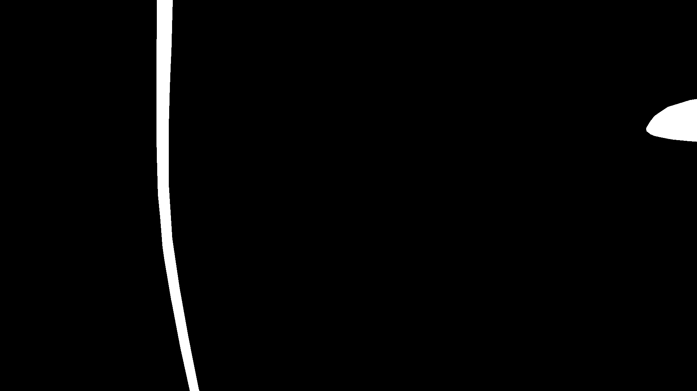

### Exercice Code Technique

Le fichier `calibration.csv` fourni est le résultat d'une calibration d'un couple boiter photo et objectif permettant de connaitre les réglages à effectuer sur l’appareil photo pour obtenir une image nette aux profondeurs voulues (profondeurs orthogonales à l'appareil).
Les images `depth*.png` fournis sont des images au format PNG 16bit où chaque pixel représente la profondeur (orthogonale en mm) de la scène capturée par l'appareil photo (dans le repère de l'appareil).

Ecrire une application C++ en ligne de commande qui prend les deux fichiers (calibration et image de depth) en paramètre et qui simule le shot des images nécessaires pour avoir l’intégralité de la scène vue nette.
Il faudra écrire une api qui représente le contrôleur de l'appareil photo et qui affiche les actions actions appelées dans la console (set, get...). Le réglage des paramètres de la camera est une action asynchone qui nécessite de vérifier l'état des paramètres avant de prendre une photo. Pour chacune des photos, un masque des zones vues nette est attendu.
Il faudrait également écrire des tests unitaires sur une fonctionnalité au choix.

Vocabulaire 

| FD | Distance du capteur à la cible |
|----|--------------------------------|
| PPN | Premier plan Net |
| DPN | Dernier Plan Net |
| Focus Position | Paramètre moteur du Focus |

The prodided input data are store gere: `/data`.


### Prerequisite
For time reasons I've chosen opencv to handle the pixel matrices. 

```
sudo apt-get install libopencv-dev
```

### Build & Run unit tests

Ensure you have gcc or any c++ compiler added into your system path. Then, run the following commands on Windows for example:

Build directly from project root directory:
```bash
cmake -S . -B build && cmake --build build
```

Run unit tests:
```bash
cd build && ctest
```
For more detailed output:
```bash
cd build/autofocus/test && ./unit_tests
```


### Run the Autofocus Main application

Run the following command :

```bash
cd build/main
./autofocus_main data/calibration.csv data/depth_1.png
```

Here is output you'll get :
```bash
[OK] Calibration file loaded (36 points)
[OK] Depth map loaded: 1920x1080 pixels
Scene depth range: [0, 397] mm
[OK] Focus sequence: 7 positions
Moving to focus position: 31826
SNAPSHOT ! @ position 31826 => depth_1_0_343_349.png
Moving to focus position: 30669
SNAPSHOT ! @ position 30669 => depth_1_1_349_355.png
Moving to focus position: 29225
SNAPSHOT ! @ position 29225 => depth_1_2_355_361.png
Moving to focus position: 28280
SNAPSHOT ! @ position 28280 => depth_1_3_360_368.png
Moving to focus position: 26561
SNAPSHOT ! @ position 26561 => depth_1_4_369_378.png
Moving to focus position: 25030
SNAPSHOT ! @ position 25030 => depth_1_5_379_389.png
Moving to focus position: 23656
SNAPSHOT ! @ position 23656 => depth_1_6_390_400.png
[DONE] Focus sweep complete and merged => depth_1_overall_0_397.png
```

Within the same directory, it will create N png files containing the mask for each focus position taken.
And one overall file combining all the mask files together (bitwise OR).

Here is an example of a png output: 


### CI

CI has been set up and uses Docker to build the code and run the unit tests suite.